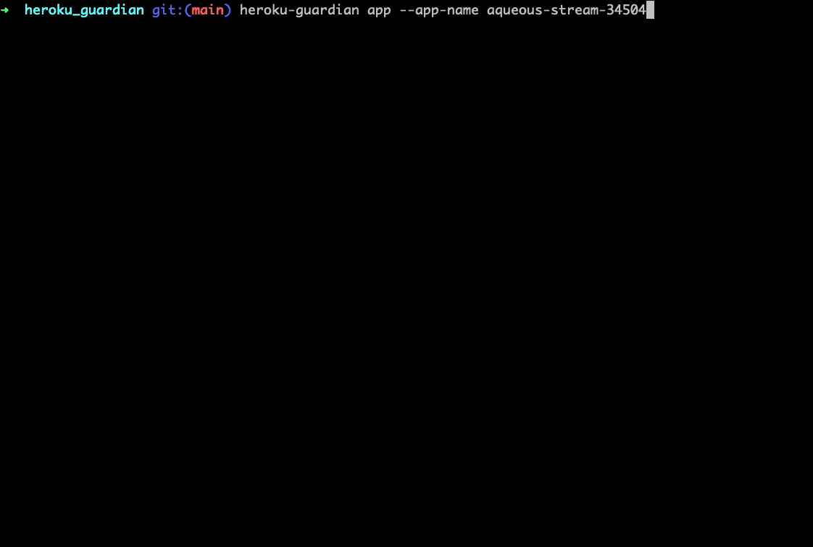

# Heroku Guardian

Simple and easy to use security checks for the Heroku platform. 

[](https://github.com/heroku/heroku-guardian/actions?query=workflow%3Acontinuous-integration)
[](https://pepy.tech/project/heroku-guardian)
[](https://twitter.com/_ashishpatel)
<p align="center">
  
</p>

<!-- toc -->

# Heroku Guardian

Purpose and functionality
* Provide you with the ability to see various configurations within Heroku that help secure your app/spaces/users
* Give users a simple CLI tool that can quickly evaluate the security of how they are deploying in Heroku
* Validate your own compliance requirements against your Heroku infrastructure

# What is Guardian?

Heroku Guardian was a tool that was created out of a need to further enable engineers with the ability to validate their configurations against a security baseline. When using any PaaS or platform to run your infrastructure or code, applying security best practice is a must. The Heroku platform itself has some great functionality built in to further reduce any potential attack surface that may be used by attackers.

# What does Guardian check for?

***App Based Security***


Build Pack: [Docs](https://devcenter.heroku.com/articles/buildpacks)

* Heroku applications are deployed on dynos, these dynos can utilize build packs to support their underlying infrastructure. There are many official build packs that can be used and this is taken into consideration when looking at the security of your app. Using official buildpacks and trusted images is an important factor in keeping your code running free from potential vulnerabilites that may be introduced into your app.

Internal Routing: [Docs](https://devcenter.heroku.com/articles/internal-routing)

* Internal routing is a feature you can use to prevent your apps from receiving external web traffic when they are used within private spaces. This is a great feature if you know you don't need certain apps being exposed over the internet and should be considered for sensitive workloads.

Add Ons: [Docs](https://devcenter.heroku.com/articles/add-ons)

* Heroku supports a robust array of add ons both official and community driven, these add ons can be used in conjunction with your apps to let your apps run with any supporting infrastructure they need. Heroku Postgres is one example of an add on that can be used with your app. Add ons should be limited to their use case and you may also have a need to only run verified and approved add ons that you have agreed on with your engineering teams.

Untrusted vs Trusted Plans: [Docs](https://www.heroku.com/pricing)

* Depending on what you are running in Heroku you may only want your engineers to run known and approved plan types. Plan types vary vastly in feature set and there may be certain security functionalities that you always want to have. Being aware of which apps are using what plan is important to validate that they are all running in compliance to what has been approved by your security team.
    
Locked Apps: [Docs](https://devcenter.heroku.com/articles/platform-api-reference#team-app)

* Locked apps can be used to prevent unwanted modification or tampering of existing apps your team, you can lock an app if you do not want modification of the app once it is deployed. This can be used to prevent production level apps from tampering or preventing potential issues with sensitive or critical apps from being changed while in flight.
           
Stack Images: [Docs](https://devcenter.heroku.com/articles/platform-api-reference#stack)

* Stack images are the underlying OS image that code will run on. Ensuring you are using the right stack images for your app is important to security, ensuring that approved and up to date stack images are used is a good check to have in place.

Maintainence Mode: [Docs](https://devcenter.heroku.com/articles/platform-api-reference#app")

* Apps can be marked as in "maintenance mode" which temporarily disables access to the app, they will normally display a static page to all visitors at this point. If you have apps with this enabled, they may need to be removed if they are no longer needed or taken a further look at to ensure normal traffic is flowing correctly to the right apps.

Domain Names: [Docs](https://devcenter.heroku.com/articles/platform-api-reference#app")

* Apps can have custom CNAME domains assigned to them so that you can point your customers or end users where you want them to go. Custom domain names can be great to prevent potential for domain based attacks and minimize risk of your own users going to the wrong site. This functionality should be considered when deploying a production level app.

Configuration Variables: [Docs](https://devcenter.heroku.com/articles/platform-api-reference#config-vars)

* A rule of thumb in security is that secrets or other sensitive variables should never be stored within source code itself. You can leverage configuration variables within Heroku to store your credentials or API tokens so that your app can utilize them from runtime. Config vars should always be used when your deployment includes these types of variables.

TLS Configuration: [Docs](https://devcenter.heroku.com/articles/platform-api-reference#app-feature)

* Heroku supports both TLS 1.2 and 1.3, ensuring you are using the right version of TLS when deploying your app is good security practice and can help to limit the number of TLS based vulnerabilites that may be used against your infrastructure.

***Space Based Security***

Private Space: [Docs](https://devcenter.heroku.com/articles/private-spaces)

* Private spaces can be used within Heroku to restrict apps and infrastructure only to your own infrastructure. These are dedicated environments for your resources which are completed isolated on the back end thus enhancing the overall security of the platform usage.

IP Ranges: [Docs](https://devcenter.heroku.com/articles/private-spaces#trusted-ip-ranges-for-data-services)

* You can easily control which IP ranges should be allowed to talk to your apps. This is a great way to limit unwanted access or traffic being sent to your app, and can be useful in cases where you may already know what ranges should be communicating with your deployments.

***User Based Security***

<!-- tocstop -->
Email Check:

* All users should have an email correctly assigned to their user.

Domain Email Being Used [Docs](https://devcenter.heroku.com/articles/platform-api-reference#account):

* In a config file you can specify what your companies email domain is, and validate if the user is correctly assigned an email from that domain within Heroku.

SSO and MFA Checks: [Docs](https://devcenter.heroku.com/articles/platform-api-reference#account):

* Users can be validated to ensure they are using the correct federated login as well as having MFA enabled. Both of these checks help to prevent against account compromise.

SSO Preferred:

* Ideally, SSO should be the preferred method of logon where possible.

<!-- requirements -->

# Requirements

In order to use Heroku Guardian, you must create an API token with either the Heroku console or the Heroku CLI. You can create an API token with the following command from the [Heroku CLI](https://devcenter.heroku.com/categories/command-line):
```
heroku authorizations:create
```

Once you have the token, you can add it to your configuration file which Heroku Guardian will use to scan your environment. The configuration file is a simple config.ini file that lives in `utils/config.ini`. 

Your basic configuration will define what Heroku Guardian should scan for and validate as it compares the API return objects against a known good configuration. This is an example of what your configuration file at that path may look like:

WARNING!!! - Make sure not to check in your API key, I've included it in the `.gitignore` file but make sure to double check this before modifying and pushing code into your own repo.

```
[AUTH]
api_key = "<your API token>"

# trusted Heroku add-ons
[ADDONS]
heroku_addon_providers = ["heroku-postgresql","heroku-kafka","heroku-redis"]

# multi-tenant heroku add-ons are untrusted 
[PLANS]
untrusted_plans = ["hobby","basic","standard","premium", "developer", "dev"]

# Heroku official build-packs should be used
[BUILDPACKS]
allowed_buildpacks = ["heroku/","https://github.com/heroku/"]

# Allowed IP ranges
[RANGES]
allowed_ranges = ["52.47.73.72/29", "13.55.255.216/29", "52.15.247.208/29"]

# Company email domain
[USER]
email_domain = "@salesforce.com"
```

<!-- requirementsstop -->


## Usage & Installation

<!-- usage -->
**Install via pip**
```
pip3 install --user heroku-guardian
```

**Install via Github**

```sh-session
$ git clone https://github.com/salesforce/heroku-guardian
$ cd heroku-guardian
$ pip install -e .

$ heroku-guardian
Usage: heroku-guardian [OPTIONS] COMMAND [ARGS]...

  Heroku guardian is a tool used to validate that your deployment,
  spaces, and user configuration are secure.

Options:
  --version  Show the version and exit.
  --help     Show this message and exit.

Commands:
  app    Perform app security checks within Heroku
  space  Perform space security checks within Heroku
  user   Perform user security checks within Heroku
```
<!-- usagestop -->

## Commands

<!-- commands -->


**heroku-guardian app**

```
heroku-guardian app --help
Usage: heroku-guardian app [OPTIONS]

Options:
  -a, --app-name TEXT    App name that you would like to perform security
                         checks for
  -s, --space-name TEXT  Space that you would like to perform security checks
                         for all apps in that space
  -l, --links            Findings with links to Heroku API documentation
  -j, --json-output      Output JSON findings
  --help                 Show this message and exit.
```


**heroku-guardian space**

```
heroku-guardian space --help
Usage: heroku-guardian space [OPTIONS]

Options:
  -s, --space-name TEXT  Space name that you would like to perform security
                         checks for
  -j, --json-output      Space check with JSON output
  --help                 Show this message and exit.
```

**heroku-guardian user**
```
heroku_guardian heroku-guardian user --help
Usage: heroku-guardian user [OPTIONS]

Options:
  -j, --json-output  User check with JSON output
  --help             Show this message and exit.
```

<!-- commandstop -->


